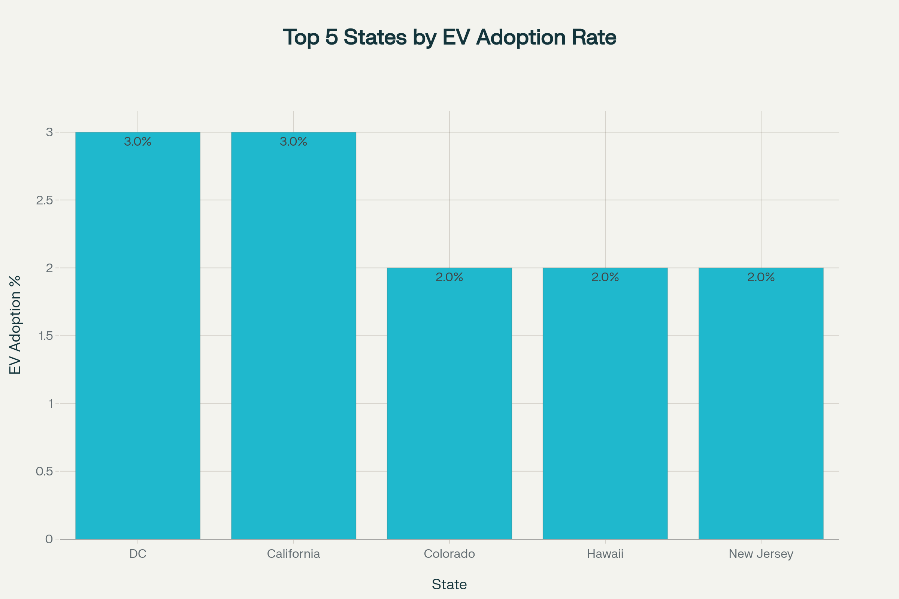
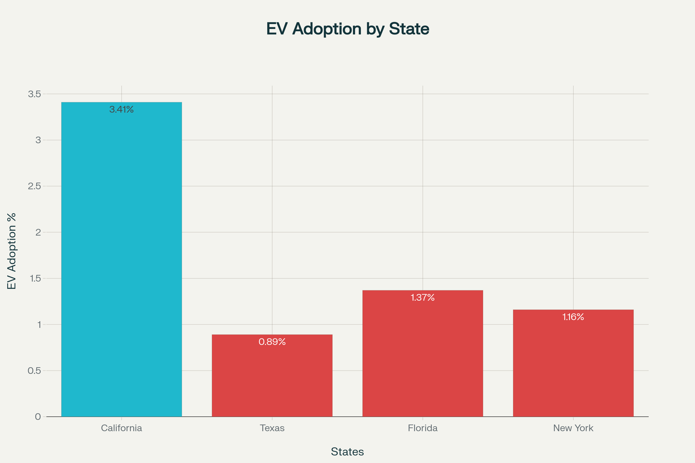

# Introduction 

This project delivers a comprehensive, data-driven analysis of alternative fuel vehicle registrations across the United States, with a particular focus on electric vehicle (EV) adoption trends. Leveraging robust SQL data processing, Excel for validation, and Tableau for visualization, the study answers pressing questions vital for transportation planning—such as state-level EV penetration, top and bottom performing states, and the national landscape of alternative fuels like E85, biodiesel, and hydrogen.

# Background

With EVs accounting for 7–11% of new U.S. vehicle sales in 2025, the nation stands at a pivotal point in its transition toward cleaner transportation. Yet, adoption remains highly uneven: a handful of states such as California pull far ahead, while many regions lag behind. Policymakers and infrastructure planners need granular, actionable insights to guide investments, close market gaps, and support the acceleration of alternative fuel use. This project was undertaken to provide such insights, demonstrate advanced technical skills, and help drive evidence-based decisions in the growing field of sustainable mobility.

# EV Distribution Highlights: Top vs. Bottom States


A basic look at the overall EV registration shows that California stands out dramatically at the top, far surpassing other states in sheer number of EVs. Florida and Texas also report high EV totals, yet their penetration rates remain modest relative to their overall fleet size. 

In contrast, the bottom states, including North Dakota, Wyoming, and South Dakota, have very limited EV adoption, each registering fewer than 2,000 electric vehicles.

These charts reveal the stark disparity in EV distribution across the nation—while some states have already embraced sizeable EV fleets, many remain in the earliest stages of adoption. This gap represents both a challenge and an opportunity for future infrastructure and policy planning, as increased support could help lagging regions accelerate EV uptake and better align with national sustainability goals.

# The Analysis

### 1. Percentage of EVs, PHEVs, HEVs, and Gasoline Vehicles by State 

Summary of Findings
- Gasoline vehicles overwhelmingly  dominate vehicle registrations across all states, with most states showing gasoline vehicle percentages above 80%. For example, Alabama shows 84.83% gasoline vehicles.
- California leads in electric vehicle adoption with 3.41% EVs, followed by notable EV percentages in Washington (2.23%), D.C. (2.60%), and Hawaii (2.37%).
- PHEVs are most prominent in states like California (1.11%), D.C. (1.19%), and Massachusetts (0.80%).
- HEVs show higher percentages compared to EVs and PHEVs in many states, such as California (4.62%), Washington (4.51%), and Massachusetts (3.41%), indicating a notable presence of hybrids in these markets.

Other Observations
- Some smaller or less populous states tend to have lower EV adoption rates but still maintain a presence, e.g., Alaska with 0.48% EVs and Vermont with 1.32%.
- While gasoline vehicles still predominate, the combined shares of EV, PHEV, and HEV suggest a growing footprint of alternative vehicle types, implying infrastructure needs will increase over time.

Implications for Infrastructure Planning
- States like California and Washington may require expanded EV charging infrastructure to support growing EV fleets.
- States with rising PHEV and HEV shares may benefit from hybrid fueling strategies and incentive programs to gradually transition users towards full EV adoption.


```sql
WITH sum_calc AS 
(SELECT
    state,
    electric,
    phev,
    hev,
    gasoline,
    (electric + phev + hev + biodiesel + e85 + cng + propane + hydrogen + methanol + gasoline + diesel + unknown_fuel) AS total_vehicles
FROM  ev_regdata
)
SELECT
    state,
    electric,
    ROUND((electric*1.0/total_vehicles)*100,2) AS ev_percentage,
    phev,
    ROUND((phev*1.0/total_vehicles)*100,2) AS phev_percentage,
    hev,
    ROUND((hev*1.0/total_vehicles)*100,2) AS hev_percentage,
    gasoline,
    ROUND((gasoline*1.0/total_vehicles)*100,2) AS gas_percentage
FROM sum_calc;
```

### 2. Top 5 States with Highest EV Adoption Rate (EVs as % of All Registered Vehicles)



Summary of Findings
- The District of Columbia and California lead EV adoption with an EV share of about 3% of total registered vehicles. These two stand out as clear frontrunners.
- Other top states include Colorado, Hawaii, and New Jersey, trailing slightly at approximately 2% EV adoption. Washington, Nevada, and Oregon also show strong adoption near the 2% mark. 
- Across the majority of states, EV adoption rates hover at around 1% or less, with many states under 1% EV penetration (40 states).
- Several large states like Texas(0.89%) and Florida(1.37%) fall behind in EV penetration despite large absolute numbers of EVs, indicating potential growth opportunities.

```sql
WITH total_ev_reg_calc AS 
(
SELECT
    state,
    electric,
    (electric + phev + hev + biodiesel + e85 + cng + propane + hydrogen + methanol + gasoline + diesel + unknown_fuel) AS total_reg
FROM ev_regdata
)
SELECT 
    state,
    electric,
    ROUND((electric*1.0/total_reg)*100,2) AS percentage_share
FROM total_ev_reg_calc
ORDER BY percentage_share DESC;
```

### 3. Compare EV adoption in California vs. other large states (e.g., Texas, Florida, New York)



Summary of Findings
- California leads with an EV adoption rate of 3.41%, significantly higher than other large states.
- Florida shows a 1.37% adoption rate, which is less than half of California's rate despite having a larger absolute number of electric vehicles (254,900 in Florida vs. 1,256,600 in California).
- New York has an EV adoption rate of 1.16%, while Texas lags behind at 0.89%, the lowest among these large states.
- Although Texas has a substantial total number of EVs (230,100), the adoption percentage is relatively low due to its large overall vehicle population.

```sql
WITH total_reg_calc AS 
(
SELECT
    state,
    electric,
    (electric + phev + hev + biodiesel + e85 + cng + propane + hydrogen + methanol + gasoline + diesel + unknown_fuel) AS total_reg
FROM ev_regdata
),
ca_adoption_calc AS 
(
SELECT
    ROUND((electric*1.0/
    (electric + phev + hev + biodiesel + e85 + cng + propane + hydrogen + methanol + gasoline + diesel + unknown_fuel)*100),2) AS ca_ev_adoption
FROM ev_regdata
WHERE state = 'California'
)
SELECT
    t.state,
    t.electric,
    ROUND((t.electric*1.0/t.total_reg)*100,2) AS ev_adoption_percentage,
    ca_ev_adoption
FROM total_reg_calc AS t
CROSS JOIN ca_adoption_calc AS c
WHERE t.state IN ('Texas', 'Florida', 'New York')
```

### 4. Highlight which alternative fuels (biodiesel, ethanol, hydrogen) have meaningful presence vs. niche usage.

Summary of Findings
- E85 (ethanol blend): With approximately 20,240,600 vehicles using E85, this fuel type represents 7.05% of the total registered vehicles, making it the most significant alternative fuel in use. This suggests ethanol blends have achieved notable market penetration and infrastructure support in the U.S.
- Biodiesel: Biodiesel accounts for about 2,803,600 vehicles, representing 0.98% of the total. While much smaller than E85, biodiesel still commands a meaningful presence, especially in niche markets like commercial trucking and fleet vehicles.

- Hydrogen: Hydrogen fuel cell vehicles are very limited, with only around 16,900 registered, or roughly 0.01% of total vehicles. This confirms hydrogen as a niche fuel currently, requiring more development and infrastructure to scale.

```sql
WITH total_summary AS
	(SELECT 
		SUM(biodiesel) biodiesel_total,
		SUM(e85) AS e85_total,
		SUM(hydrogen) AS hydrogen_total,
		SUM(electric + phev + hev + biodiesel + e85 + cng + propane + hydrogen + methanol + gasoline + diesel + unknown_fuel) AS total_vehicles
	FROM ev_regdata)
SELECT 
	biodiesel_total,
    ROUND((biodiesel_total*1.0/total_vehicles)*100.0,2) AS biodiesel_perc,
    e85_total,
    ROUND((e85_total*1.0/total_vehicles)*100.0,2) AS e85_perc,
    hydrogen_total,
    ROUND((hydrogen_total*1.0/total_vehicles)*100.0,2) AS hydrogen_perc
FROM total_summary;
```

# Conclusion
This analysis demonstrates stark disparities in EV distribution across U.S. states, with California maintaining a clear lead in both total electric vehicles and market share, while most other states are still in the initial stages of adoption.

Although E85 (ethanol blend) has achieved meaningful national presence at over 7%, other alternative fuels like biodiesel and hydrogen remain niche, underscoring limited diversification. 

Meanwhile, gasoline vehicles continue to dominate the market, but both hybrids and plug-in hybrids are gaining a modest foothold. These trends spotlight the need for targeted infrastructure investment, policy action, and education to accelerate EV and alternative fuel growth, especially in states where the potential for adoption remains largely untapped.
